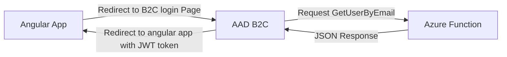

# Create a self-signed certificate

## Summary

Every time we need to authenticate  the Angular App we are redirected to AAD B2C login page to provide our credentials, once it is done, a request to an Azure Function is triggered to execute some business role, in this case *GetUserByEmail*. The result is sent back to AAD B2C that will create new claims within the JWT token and redirect the user to the Angular App.

The communication between AAD B2C and the Azure Function will be secure by TLS Mutual, to implement it we need to create a self-signed certificate or use one you already have. 

## Execution step 
Microsoft documentation describes how create a self-signed certificate in the section [Prepare a self-signed certificate (optional)](https://docs.microsoft.com/en-us/azure/active-directory-b2c/secure-rest-api#prepare-a-self-signed-certificate-optional) , this is the only section we need to fallow from this article.